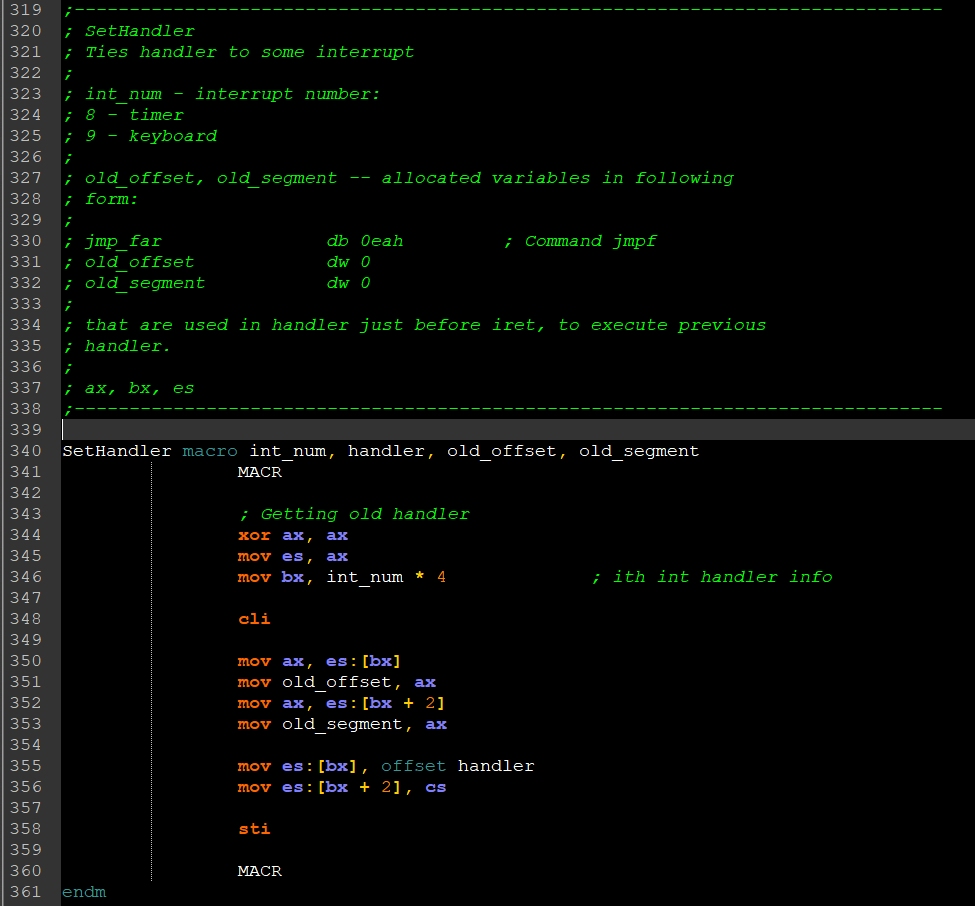
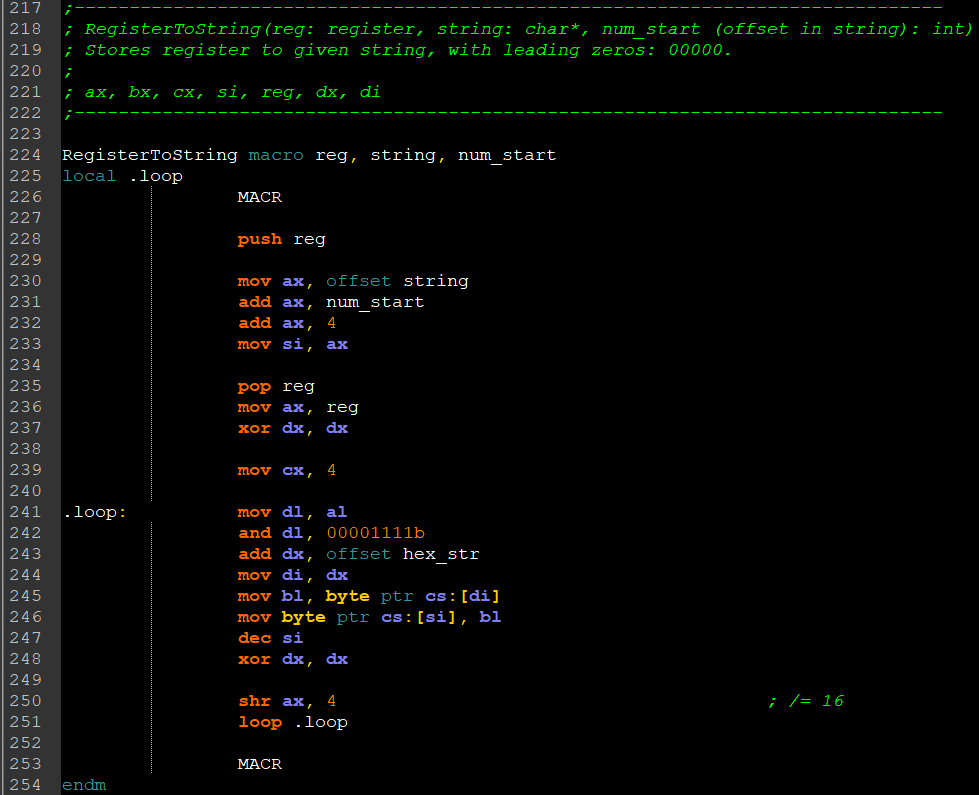
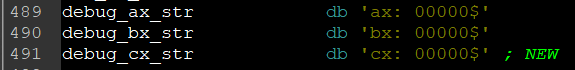
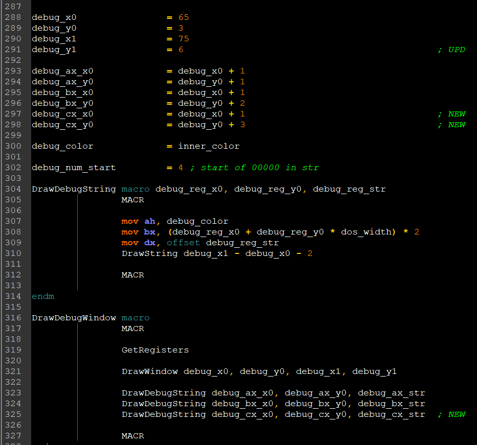
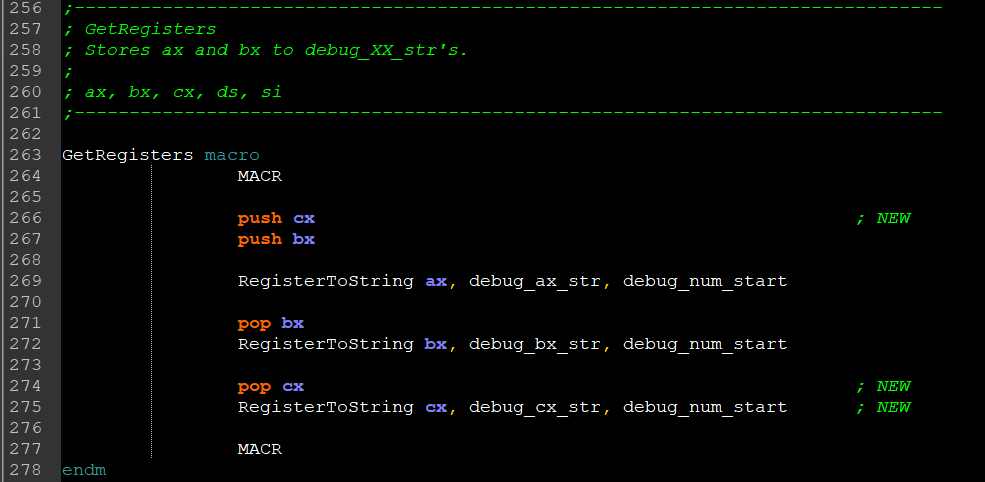
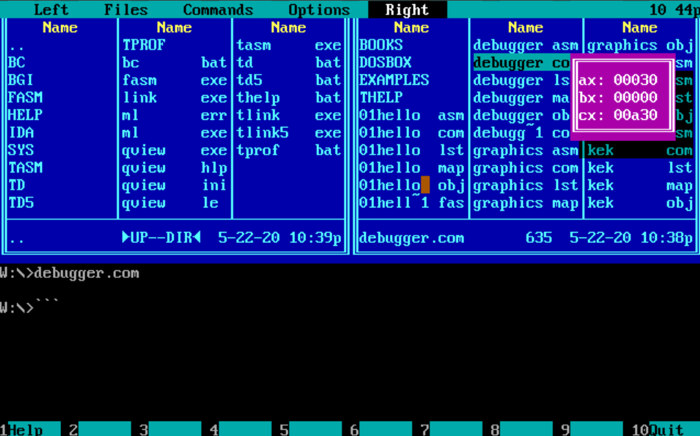

# mini-debugger

# Task:
Using tasm, make a resident program that displays current values of `ax` and `bx` registers.

# Realization:
1. Made a custom macro for setting/unsetting a handler for a resident program, as well as exiting.

2. Made a custom macro for displaying a register's value onto the screen.

3. Considering my architecture, is it easy to add another register to display? Let's find that out by adding a new register to display: `cx`.
    1. Add a new format string for `cx`:
    
    2. Resize the debug window and add a new entry in Drawing Debug Strings:
    
    3. Change GetRegisters macro:
    
    4. ???
    5. profit
4. Final result:

