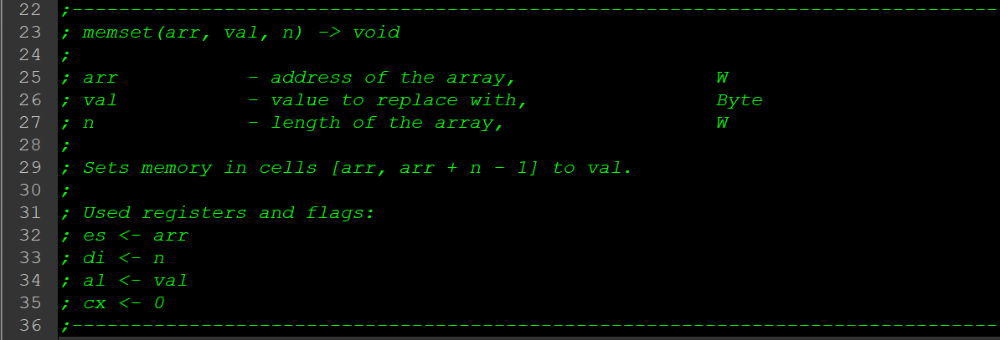
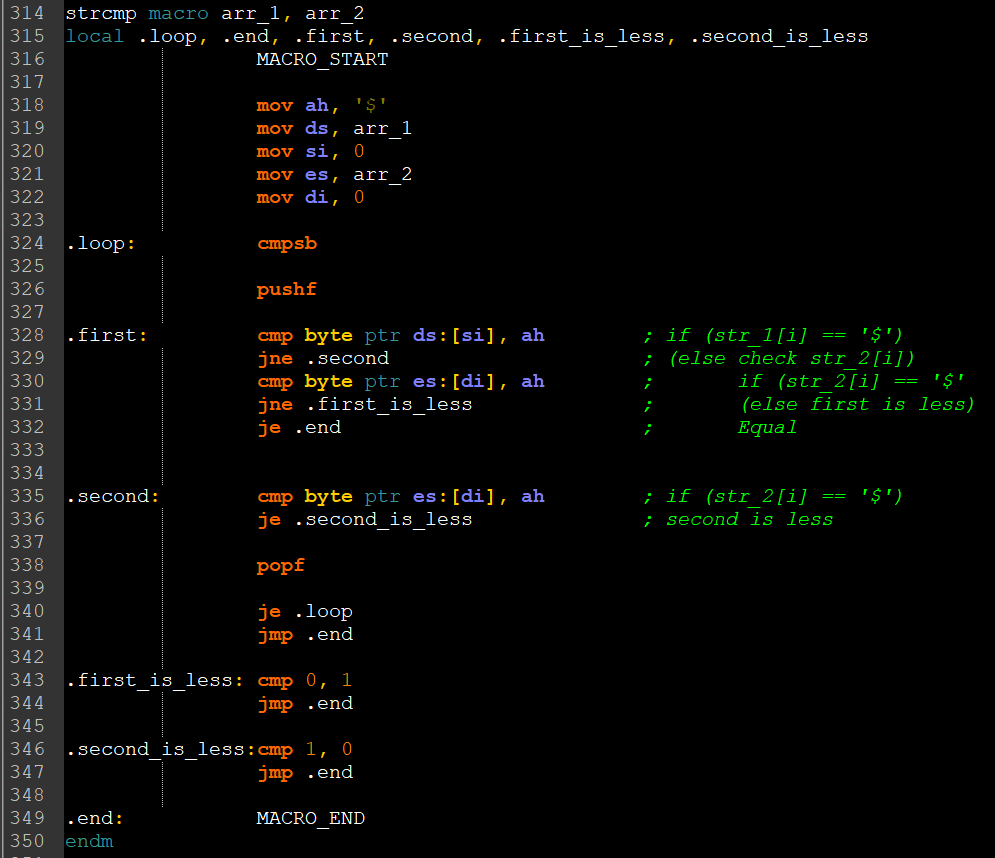

# string-functions.

# Task:
Using tasm, make a library of string manipulation functions.

# Realization:
1. Developed a concise function headers that tell the user the needed information, such as
    1. Its signature
    2. Description of parameters
    3. Description of the function
    4. Used registers and flags.

2. For strings chose the O(n) way, where the comparison with `'\0'` is performed every iteration.

3. Also chose the path of returning flags instead of values in strcmp.

