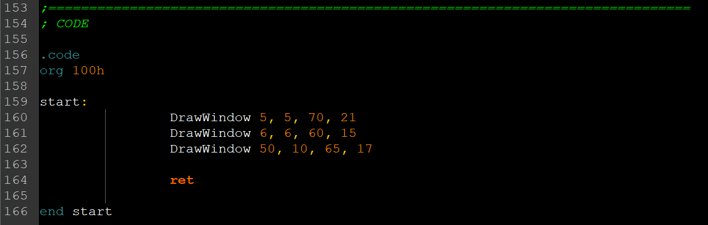

# Window

## Task:
Using tasm, create an executable that projects a window made of characters.

## Realization:
1. Windows are fully customizable, down to every character the user will see: 

2. Windows will also cast shadows, which is done through nullyfication of some bits in words that represent characters on the screen:

3. Creating a window is simple: just write those macros down:

4. Final result:

