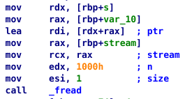
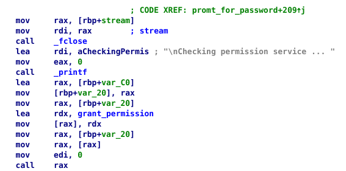
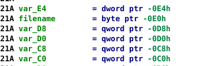
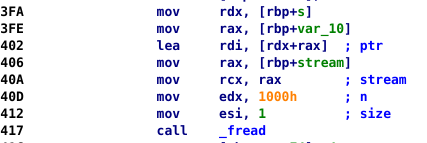

# Hints
The hints are sorted according to the order of analysing the executable.

1. Q: Where do I start? A: Inspecting the executable with an external tool for analysing the binary files, you might want to get through all the file to find clues. You might see that there are functions `grant_permission` and `deny_permission`. The former is the one you should execute in order to get the permission.

2. Q: How do I execute this function? A: There are several exploits that can be used. The one that is present here is the buffer overflow. Namely, we will aim for overflowing the stack to change the return address that is stored right after the current stack frame. You just have to copy and paste the address of a function you want to execute into the return address field of the stack, making sure that it is written in `little-endian` byte order.

3. Q: How do I get the address of the function `grant_permission`? A: Since the build provided has been built with the `-fPIE` key, there is no way we can know the address of the function before the program runs. That assumes we have to use yet another exploit. For this one, let's take a closer look at the function `prompt_for_password`, which has the most logic in the executable. Do not fear the massive number of `mov`'s happening at the beggining. It's just the way compiler decided to fill the initial buffer with certain constant string. The most part of it is the debug information that is displayed every time the user enters the file containing the password. As we might notice (see the picture), the programmer decided not to use a format string for the function `printf` as the first argument, but rather use the string he got from the user. As it turns out, the string that is used here is the one that uses exactly five format arguments for displaying debug information, which suggests that if the user decides to write another argument, the `printf` function will search other arguments starting from the top of the stack. Very conviniently, we can notice the presence of `grant_permission` in this function. Even more, the address is store on the stack (see the second picture). Analysing the code, we can conclude that `grant_permission`'s address is stored at the `rbp+var_C0` address. Let's take a closer look at the top of the stack that `Ida` reveals (picture three). `var_C0` is three `qword`s, one `byte` and one `dword` apart from the top of the stack. Recall that the `rsp` must be aligned to 4 bytes boundary. This means that the password which goes like `%zx|%zx|%c|%zx|%zx|%zx|%zx` will read all entries from the top of the stack, revealing the address of the `grant_permission` at the end.

4. Q: How do I write this address to the return address? A: As was mentioned above, it will suffice to use the exploit aimed at overflowing the stack. Conviently enough, the programmer didn't care how many characters the password given in the file has. Looking at the code (see the picture), we can determine the start of the buffer to which the user's password will be transferred to. It's essentially the address comprised of `s+var_10`. Analysing the code we can end up with the number for the desired offset relative to the `rbp`. It is `3A`. This means that we should write `3A` + 8 (because of the stored previous `rbp`) characters in password to get to the offset of the return address. The last 8 characters of the password should be the ones that make up the address of the function `grant_permission`. The only thing to notice here is that only on the fourth attempt will the function actually return with no corruption using the password string discussed above.

The sample files for a solution are available in the folder `solution`.
